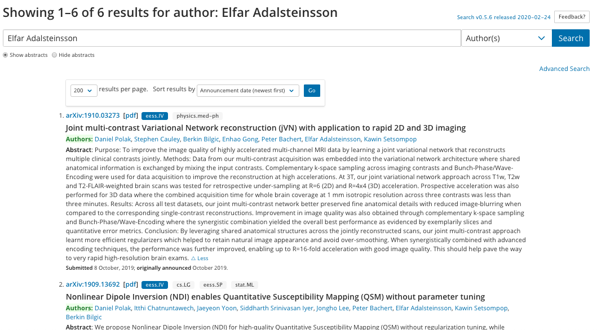

# Applying LDA Topic Modeling to MIT Research Paper Abstracts

Abstract papers will be taken from MIT EECS faculty members as found on the MIT website.

Once we have a list of all current faculty for this department, we can lookup each as an author on arXiv.org to determine all the research papers they have written and grab the abstract from each.

With Beautiful Soup, we can query and webscrape the text info from each query result webpage for processing.

Once we have the list of abstracts, we can apply LDA Topic Modeling to it after we preprocess the text.

Stop words and punctuation are removed from the text, and words are stemmed and tokenized.

Here are the results of the LDA:

Here is a visualization of the topic distribution across all the abstracts:

